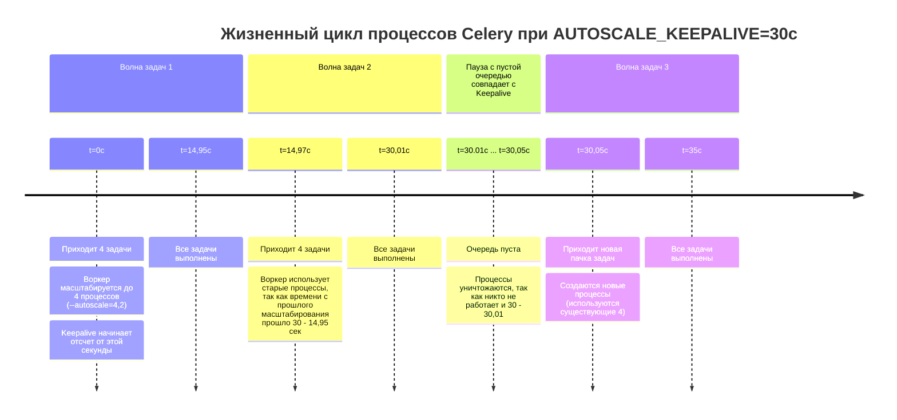

## Celery Autoscale: что в лоб — то по лбу.

Моей первой большой самостоятельной работой программиста была инвентаризация celery-задач. Нам с товарищем по бэкенду достался легаси-проект товарно-учетного приложения.
С горем пополам перевезли его из Hetzner в родное "облако" и поняли, что срочно необходимо всё документировать, очищать и структурировать.
Пока коллега упаковывал в контейнеры приложение, я занялся Celery, так как на этой библиотеке завязано много бизнес-логики.

Пока группировал и отлаживал задачи, определял им очереди, нашел в документации загадочное *autoscale*. Кажется, что в тот момент этот параметр светился золотом.
Вот оно! То, что нужно! Сейчас там как всё наладится и заработает без сучка и задоринки. Ровно, чинно, благородно.

Мне повезло, что так и случилось, очереди стали более спокойными. Причин тому несколько:
- было достаточно ресурсов сервера;
- задачи были, в основном, I\O-bound;
- в процессе работы избавился от некоторых утечек памяти и ограничил время исполнения самых "отмороженных" задач.

Только спустя время я решил отрефлексировать и пересмотреть тот опыт и был удивлен, что мне реально повезло.
И вот в чём: мы посмотрим, как autoscale работает в действительности на разного рода задачах и как на такую "самостоятельность" реагирует система.
Если у вас есть сомнения, стоит ли читать статью, то предлагаю решить загадку:
```
1. Запускаем воркер:
    ```
    -A celery_app worker --autoscale=4,2 --worker_prefetch_multiplier=1
    ```
2. Запускаем скрипт:
    ```
    for idx_task in range(1, 601):
        cpu_intensive_task.delay()
        if idx_task % 4 == 0:
            time.sleep(1.7)
    ```
3. Который генерирует такие задачи:
    ```
    @celery.task(name='cpu_intensive')
    def cpu_intensive_task() -> int:
        result = 0
        for i in range(10**7):
            result += i**2
        time.sleep(1)
        return result
    ```

Вопрос: сколько всего процессов будет создано за время обработки 600 задач?
```
Варианты ответа:
1. 31
2. 4
3. 150
4. 0

Если выбрали второй вариант — 4 процесса, то мне есть, чем вас удивить.
Правильный ответ будет позже.

### О понятиях
**Воркер** — экземпляр Celery, включающий в себя процесс-супервизор и все дочерние процессы.

**Супервизор** — ведущий процесс воркера, устанавливающий соединение с брокером и порождающий, 
а в дальнейшем и дирижирующий прочими рабочими процессами. Непосредственно сам задачи не обрабатывает.

**Рабочий процесс** — дочерний процесс супервизора внутри воркера, обрабатывающий задачи. Создан или при старте воркера(concurrency), или динамически(autoscale).

**Равномерная очередь** — очередь, в которой показатель Total в любой момент времени не превышает количество рабочих процессов.

**Накопительная очередь** — очередь, которая может иметь задачи в статусе Ready(Total больше рабочих процессов).

### Prefork autoscale
Для тех, кто не знаком с Python, Celery — распределенная очередь задач, работающая через брокер сообщений.
Использует собственную библиотеку(billiard, форк от стандартной питоновской) для механизма многопроцессорности.
Prefork — это пул по умолчанию и по совместительству самый распространенный режим, к которому применим autoscale.
Хорош для CPU-bound да и для прочих, так как не требует сторонних библиотек.

Механизм autoscale запускается в двух местах:
1. Это собственный цикл с методом maybe_scale() класса Autoscaler, 
    который крутится и смотрит:
    - есть ли что в очереди? 
    - можно ли добавить рабочих процессов?
2. Это callback от брокера при получении сообщения.

А вот "демасштабирование" работает по расписанию и происходит исключительно тогда, 
когда с последнего увеличения прошло более 30 секунд, значение по умолчанию для AUTOSCALE_KEEPALIVE.

В чем подвох загадки? В AUTOSCALE_KEEPALIVE.
У нас есть задачи, которые по четыре штуки(одна на рабочий процесс) между паузами попадают в очередь.
Воркер их подхватывает, создает дочерние процессы и раздает им задачи.
Важно, что AUTOSCALE_KEEPALIVE отсчитывается от последнего scale_up().
Время на обработку задачи примерно от 1.6 до 2.2 секунды, то есть пауза настроена примерно так,
чтобы воркер закончил обработку, взял новую партию задач и очередь была +/- пустой.
Плюс, казалось бы, пренебрежительные миллисекунды на публикацию сообщений и IPC.
Но по итогу нам это дает следующее: каждый рабочий процесс подходит к порогу AUTOSCALE_KEEPALIVE,
выполнив примерно 15 задач и очень может быть, что сейчас ждет новую.
Но цикл maybe_scale(), глядя на пустую очередь и простаивающий процесс, считает его лишним и "сворачивает".

Схематично это выглядит так(для иллюстрации время обработки задач увеличено).



Но следом поступают задачи. И мы вынуждены снова создавать рабочие процессы.
И так повторяется практические каждые 30 секунд.

Здесь и кроется причина, что ответ не четыре, а *31*.
Четыре процесса за полный цикл работы возможны при AUTOSCALE_KEEPALIVE=600.
**Правильный ответ — 31.**

*Отмечу, что возможно до 40 процессов: зависит от "железа".*
*У меня задача считалась от 1.58 до 1.92 сек*

На графике в брокере это может выглядеть так:
- левая сторона с пиками(пример накопительной очереди), здесь autoscale будет трудно хулиганить с порождением процессов;
- для правой же стороны(пример равномерной очереди) ситуация становится обратной.


Казалось бы! А вона оно как.

### Prefork concurrency
В сравнении с autoscale, concurrency — "скучная" технология: какой лимит задал при запуске(или кол-во ЦПУ по умолчанию)
столько и будет работать всю жизнь воркера. Если без форс-мажора или без ограничений параметрами max_per_child_*.
Кстати, тоже любопытная особенность, на мой взгляд, неочевидная:
worker_max_memory_per_child ограничивает рабочий процесс по потребляемой памяти не в момент исполнения,
а в продолжительности его жизни, то есть если вы настроили 10 KB,
а задача потребила 20 KB, то после выполнения процесс будет заменён новым. Причем память все равно может утекать,
так как исчерпание предела проверяется после выполнения задачи; внутри же — можно и OOM Killer схлопотать.
Поэтому эта настройка может выйти боком и процессы будут пересоздаваться чаще, чем требуется.

#### Что такое производительность? ИСПРАВИТЬ!!!!!!!!!!1
| Тип метрики                     | Что измеряем                        | Совместимость с autoscale                                                                  |
|---------------------------------|-------------------------------------|--------------------------------------------------------------------------------------------|
| Throughput (задач/сек)          | Пиковая пропускная способность      | При "рваной" нагрузке — хорошо, при равномерной — хуже concurrency                         |
| Latency (время задачи)          | Отклик на одну задачу               | Из-за спавна процессов латентность первых задач для каждого рабочего процесса выше         |
| Обработка N задач (общее время) | Время выполнения скопа              | Зависит от keepalive: если пачки частые, то процессов накапливается много                  |
| Шумный сосед                    | Съедание ресурсов у других сервисов | Autoscale, особенно при ЦПУ-хваткой задаче, может расплодится и вытеснить основные сервисы |

Здесь будем смотреть на throughput и latency, так как они страдают в первую очередь.

## Runtime
Давайте же посмотрим, как с подобными загадке задачами будет масштабироваться celery.
Я подготовил сводные таблицы с фиксированными и динамическими рабочими процессами, 
отображающую производительность, за которую мы можем побороться этими инструментами.

Все замеры проведены с версией celery 5.6.3, на 12-ядерном ноутбуке 
с процессором AMD Ryzen 5 5500U with Radeon Graphics × 6 
в консоли Linux Mint 22.3 - Cinnamon 64-bit.
Брокер: RabbitMQ. *Для некоторых брокеров, к примеру, старых версий Redis механизм получения задач может работать иначе.*
С помощью cgroups ограничил воркер 2 процессорами.
Задачи типа I/O и memory-bound со средней продолжительностью 1.65 в нормальном режиме.
Общая длительность одного замера 5 минут.
Каждый вариант 15 раз.

Мы посмотрим на общее кол-во процессов, которые будут созданы.
Как меняется скорость обработки одной задачи и общая пропускная способность.

Все приведенные ниже показатели это среднее на один процесс 15 прогонов, 
то есть для конкуренси за 15 прогонов будет всего 30 процессов, 
а результат приведен для такого среднего процесса.
Кроме кол-ва процессов, это уже среднее за прогон.

### 2 рабочих процесса
#### Равномерная очередь

| Режим       | Пр-сов* | Завершено задач | latency (с)** | throughput (з/с) | ЦПУ, % | РАМ, МБ | vol_ctxt_sw*** | nonvol_ctxt_sw**** |
|-------------|---------|-----------------|---------------|------------------|--------|---------|----------------|--------------------|
| autoscale   | 6.86    | 328             | 1.79          | 1.08             | 31.24  | 115.08  | 558            | 1595               |
| concurrency | 2       | 354             | 1.64          | 1.16             | 25.64  | 119.92  | 7638           | 12804              |

`* - среднее за прогон. Остальные показатели среднее за процесс всех прогонов;
** - без учета ожидания в очереди;
*** - добровольное переключение контекста;
**** - недобровольное переключение контекста.
Большая разница этих показателей в том, что это метрика накопительная. 
Для автоскейла, где минимум это отсутствие процессов, значение обнуляется каждый прогон.
Поэтому для последующих замеров метрику удалил. Но решил отметить этот момент, чтобы абы чего не вышло.
`

#### Накопительная очередь

| Режим       | Пр-сов | Завершено задач | latency (с) | throughput (з/с) | ЦПУ, % | РАМ, МБ |
|-------------|--------|-----------------|-------------|------------------|--------|---------|
| autoscale   | 2.26   | 322             | 1.87        | 1.06             | 35.36  | 114.35  |
| concurrency | 2      | 357             | 1.68        | 1.17             | 28.49  | 118     |

### 4 рабочих процесса. ДАННЫЕ ЗАМЕНИТЬ ПОСЛЕ ПРОГОНОВ(!) + ДОБАВИТЬ СКРИНЫ ОТ ПЕРФ!!!!!
#### Равномерная очередь

| Режим       | Пр-сов | Завершено задач | latency (с) | throughput (з/с) | ЦПУ, % | РАМ, МБ |
|-------------|--------|-----------------|-------------|------------------|--------|---------|
| autoscale   | 6.86   | 328             | 1.79        | 1.08             | 31.24  | 115.08  |
| concurrency | 2      | 354             | 1.64        | 1.16             | 25.64  | 119.92  |
#### Накопительная очередь

| Режим       | Пр-сов | Завершено задач | latency (с) | throughput (з/с) | ЦПУ, % | РАМ, МБ |
|-------------|--------|-----------------|-------------|------------------|--------|---------|
| autoscale   | 2.26   | 322             | 1.87        | 1.06             | 35.36  | 114.35  |
| concurrency | 2      | 357             | 1.68        | 1.17             | 28.49  | 118     |


### 8 рабочих процессов. ДАННЫЕ ПЕРЕПРОВЕРИТЬ! Для равномерной очереди снизить множитель сна!
#### Равномерная очередь

| Режим       | Пр-сов | Завершено задач | latency (с) | throughput (з/с) | ЦПУ, % | РАМ, МБ |
|-------------|--------|-----------------|-------------|------------------|--------|---------|
| autoscale   | 70.8   | 944             | 1.89        | 3.09             | 18.16  | 110.07  |
| concurrency | 8      | 944             | 1.86        | 3.09             | 17.76  | 119.51  |

#### Накопительная очередь

| Режим       | Пр-сов* | Завершено задач | latency (с) | throughput (з/с) | ЦПУ, % | РАМ, МБ |
|-------------|---------|-----------------|-------------|------------------|--------|---------|
| autoscale   | 12      | 1194            | 2.00        | 3.95             | 24.71  | 116.13  |
| concurrency | 8       | 1270            | 1.88        | 4.20             | 24.70  | 116.8   |


### Малые выводы для autoscale пула prefork
1) Пустая очередь — не признак хорошей работы. По таблицам видно, что ПС выше для накопительных очередей.
2) Concurrency выигрывает до 10% по производительности и до 8% по latency из-за создания процессов.
3) Autoscale это не столько механизм масштабирования, сколько доп сила для нерегулярной доп работы за доп траты.
Делать его основным вряд ли хорошая идея, лучше остановится на concurrency, который скорее всего с лихвой оправдает ожидания.
Так как ОС приходится тратить ~5% сил на создание и удаление процессов autoscale(см. графики perf)

Однако если есть явное деление на ночные и дневные задачи и/или есть пиковые часы, то autoscale может стать хорошим подспорьем,
особенно, если задачи не слишком короткие или очередь быстро растет, чтобы вероятность попадание в окно "прунинга" процессов была ниже.
Да и использовать autoscale, как защиту от утечек памяти тоже так себе затея.
Надеюсь статья станет для вас хорошим подспорьем для проведения инвентаризации собственных celery-задач.

В общем, если у вас(ПРИМЕРЫ ТАКИХ ЗАДАЧ):
1) задачи поступают равномерно и их разброс +\- 2 задачи в секунду;
2) если важен latency;
3) если вы при низкой нагрузке не задаете worker_prefetch_multiplier как единицу,
то в этих случаях лучше остановиться на concurrency.

Умозрительно и без подробностей autoscale подходит для равномерной очереди с **предвиденным** периодическим наплывом задач,
когда очередь нужно быстро вернуть к нормальному состоянию и до следующего наплыва больше, чем 10-30-60 минут,
чтобы сглаживались издержки по обслуживанию процессов.

### В качестве заключения
Я не стал описывать принципы работы Celery с архитектурными особенностями, иначе бы вышло громоздко и отвлекло от темы.
Если будет интересно — следующей разберу архитектуру фреймворка, 
также планирую осветить темы Canvas Workflows и масштабирования для gevent/eventlet и docker/K8s.
