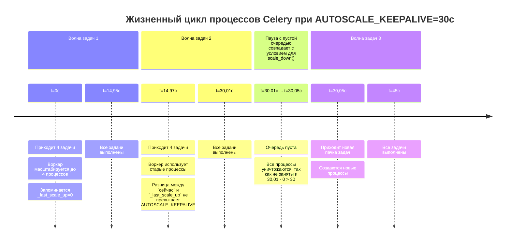

## Celery Autoscale: что в лоб — то по лбу.

Моей первой большой самостоятельной работой программиста была инвентаризация celery-задач. Нам с товарищем по бэкенду достался легаси-проект товарно-учетного приложения.
С горем пополам перевезли его из Hetzner в родное "облако" и поняли, что срочно необходимо всё документировать, очищать и структурировать.
Пока коллега упаковывал приложение в контейнеры, я занялся Celery, так как на этой библиотеке было завязано много бизнес-логики.

Пока группировал и отлаживал задачи, определял им очереди, нашел в документации загадочное *autoscale*. Кажется, что в тот момент этот параметр светился золотом.
Вот оно! То, что нужно! Сейчас там как всё наладится и заработает без сучка и задоринки. Ровно, чинно, благородно.

Мне повезло, что так и случилось, очереди стали более спокойными. Причин тому несколько:
- было достаточно ресурсов сервера;
- задачи были, в основном, I\O-bound;
- в процессе работы избавился от некоторых утечек памяти и ограничил время исполнения самых "отмороженных" задач.

Только спустя время я решил отрефлексировать и пересмотреть тот опыт и был удивлен, что мне реально повезло.
И вот в чём: мы посмотрим, как autoscale работает в действительности на разного рода задачах и как на такую "самостоятельность" реагирует система.
Если у вас есть сомнения, стоит ли читать статью, то предлагаю решить загадку:
```
1. Запускаем воркер:
    ```
    -A celery_app worker --autoscale=4,0 --worker_prefetch_multiplier=1
    ```
2. Запускаем скрипт:
    ```
    for idx_task in range(1, 601):
        io_task.delay()
        if idx_task % 4 == 0:
            time.sleep(1.7)
    ```
3. Который генерирует такие задачи:
    ```
    @celery.task(name='io')
    def io_task() -> int:
        result = 0
        for i in range(10**7):
            result += i**2
        time.sleep(1)
        return result
    ```

Вопрос: сколько всего процессов будет создано за время обработки 600 задач?
```
Варианты ответа:
1. 31
2. 4
3. 150
4. 0

Если выбрали второй вариант — 4 процесса, то мне есть, чем вас удивить.
Правильный ответ будет позже.

### О понятиях
**Воркер** — экземпляр Celery, включающий в себя процесс-супервизор и все дочерние процессы.

**Супервизор** — ведущий процесс воркера, устанавливающий соединение с брокером и порождающий и управляющий
прочими рабочими процессами. Сам задачи не обрабатывает.

**Рабочий процесс** — дочерний процесс супервизора внутри воркера для обработки задач. Создан или при старте воркера(concurrency), или динамически(autoscale).

**Равномерная очередь** — очередь, в которой показатель Total(RabbitMQ) в любой момент времени не превышает количество рабочих процессов.

**Накопительная очередь** — очередь, которая может иметь задачи в статусе Ready(RabbitMQ), а Total больше количества рабочих процессов.

### Prefork autoscale
Для тех, кто не знаком с Python, Celery — распределенная очередь задач, работающая через брокер сообщений.
Использует собственную библиотеку(billiard, форк от стандартной питоновской) для механизма мультипроцессинга.
Prefork — это пул по умолчанию и по совместительству самый распространенный режим, к которому применим autoscale.
Хорош для CPU-bound да и для прочих, так как не требует сторонних библиотек.

Параметры autoscale задаются на старте воркера `--autoscale=max,min` и весь жизненный цикл проходит между этих границ.
Воркеру необходимо нужно проверять всем ли условиям на настоящий момент он соответствует.
Механизм autoscale запускается в двух местах:
1. Это собственный цикл с методом maybe_scale() класса Autoscaler, 
    который крутится и смотрит:
    - есть ли что в очереди? 
    - можно ли добавить рабочих процессов?
2. Это callback при получении сообщения от брокера.

А вот "демасштабирование" работает по расписанию и происходит только тогда, 
когда с последнего scale_up прошло более 30 секунд, значение по умолчанию для AUTOSCALE_KEEPALIVE.

В чем подвох загадки? В AUTOSCALE_KEEPALIVE и минимальном количестве процессов(их вовсе нет)
Каждые 1.7 секунд четыре задачи(по штуке на рабочий процесс) попадают в очередь.
Воркер их подхватывает, создает дочерние процессы и раздает им задачи.
Важно, что AUTOSCALE_KEEPALIVE отсчитывается от последнего scale_up().
Время на обработку задачи примерно от 1.6 до 2.2 секунды, то есть пауза в цикле(1.7) настроена так,
чтобы воркер закончил обработку, взял новую партию задач и очередь была +/- пустой.
Плюс, казалось бы, пренебрежительные миллисекунды на публикацию сообщений и IPC.

Но по итогу нам это дает следующее: каждый рабочий процесс подходит к порогу AUTOSCALE_KEEPALIVE,
выполнив примерно 15 задач и очень может быть, что сейчас ждет новую.
Но цикл maybe_scale(), глядя на пустую очередь и простаивающий процесс, считает его лишним и "сворачивает".

Схематично это выглядит так(тайминги условны).



Но следом поступают задачи. И мы вынуждены снова создавать рабочие процессы.
И так повторяется практические каждые 30 секунд.

Здесь и кроется причина, что ответ не четыре, а *31*.
Четыре процесса за полный цикл работы в описанных условиях возможны при AUTOSCALE_KEEPALIVE=600.

**Правильный ответ — 31.**

*Отмечу, что разброс может быть от 23 до 40 процессов: зависит от "железа".*
*У меня задача считалась от 1.58 до 1.92 сек*

На графике в брокере это может выглядеть так:
- левая сторона с пиками(пример накопительной очереди), здесь autoscale будет трудно хулиганить с порождением процессов;
- для правой же стороны(пример равномерной очереди) ситуация становится обратной.


Казалось бы! А вона оно как.

### Prefork concurrency
В сравнении с autoscale concurrency — "скучная" технология: какой лимит задан при запуске
столько рабочих процессов и будет работать всю жизнь воркера(если лимит не задан, то по умолчанию использует кол-во ядер).
У него нет специальных циклов для проверки всем ли параметрам он соответствует, его ценят таким, какой он есть. И в том же количестве.
Исключением из этого правила могут стать специальные аргументы, используемые при настройке инстанса Celery.
Или форс-мажоры типа падения воркера. Впрочем, эти же факторы распространяются и на autoscale 

Я не буду подробно останавливаться на всем многообразии параметров, упомяну лишь те, что непосредственно влияют на тему статьи. 
Это `--max-tasks-per-child` и `--max-memory-per-child`.
Если с первым из названия можно понять, что это ограничение на общее кол-во выполненных задач дочерним процессом.
То у второго параметра есть любопытная особенность, на мой взгляд, неочевидная:
`--max-memory-per-child` ограничивает рабочий процесс по потребляемой памяти не в момент исполнения,
а в продолжительности его жизни, то есть если вы настроили 10 KB,
а задача потребила 20 KB, то после выполнения процесс будет заменён новым. Причем память все равно может утекать,
так как исчерпание предела проверяется после выполнения задачи; внутри же — можно и OOM Killer схлопотать.
Поэтому эта настройка может выйти боком и процессы будут пересоздаваться чаще, чем требуется.


## Runtime
Давайте же посмотрим, как с подобными загадке задачами будет масштабироваться celery.
Я подготовил сводные таблицы с фиксированными и динамическими рабочими процессами, 
отображающую производительность, за которую мы можем побороться этими инструментами.

#### Что такое производительность?
В настоящем контексте мы можем рассматривать 4 вида производительности из таблицы ниже. 
Упор будет на throughput и latency, так как они страдают в первую очередь.

| Тип метрики                           | Что измеряем                        | Совместимость с autoscale                                                                  |
|---------------------------------------|-------------------------------------|--------------------------------------------------------------------------------------------|
| Throughput (задач/сек)                | Пропускная способность              | При накопительной нагрузке — хорошо, при равномерной — хуже concurrency                    |
| Latency (от постановки до исполнения) | Отклик на одну задачу               | Из-за спавна процессов латентность первых задач для каждого рабочего процесса выше         |
| Обработка N задач (общее время)       | Время выполнения скопа              | Autoscale нужно будет время на разгон                                                      |
| Шумный сосед                          | Съедание ресурсов у других сервисов | Autoscale, особенно при ЦПУ-хваткой задаче, может расплодится и вытеснить основные сервисы |

Все замеры проведены с версией celery 5.6.3, на 12-ядерном ноутбуке 
с процессором AMD Ryzen 5 5500U with Radeon Graphics × 6 
в консоли Linux Mint 22.3 - Cinnamon 64-bit.
Брокер: RabbitMQ. *Для некоторых брокеров, к примеру, старых версий Redis механизм получения задач может работать иначе.*
С помощью cgroups ограничил воркер 2 процессорами; настройка worker_prefetch_multiplier=1(см. ниже).
Задачи типа I/O и memory-bound со средней продолжительностью 1.65 в нормальном режиме.
Общая длительность одного замера 5 минут.
Каждый вариант 15 раз.

Мы посмотрим на общее кол-во процессов, которые будут созданы.
Как меняется скорость обработки одной задачи и общая пропускная способность.

Все приведенные ниже показатели это среднее на один процесс 15 прогонов, 
то есть для concurrency за 15 прогонов будет всего 30 процессов, 
а результат приведен для такого среднего процесса.
Кроме кол-ва процессов, это уже среднее за прогон.

### 2 рабочих процесса
#### Равномерная очередь

| Режим       | Пр-сов | Завершено задач | latency (с)  | throughput (з/с) |
|-------------|--------|-----------------|--------------|------------------|
| autoscale   | 11.93  | 29.68           | 1.65         | 1.16             |
| concurrency | 2      | 177.00          | 1.63         | 1.16             |

*Примечание: первоначально метрики включали в себя и переключение контекста. 
Но в процессе подведения итогов было замечено, что разница между типами может быть десятки раз.
Это связано с тем, что метрика накопительная, и для autoscale, где процессы заменяются, трудно достичь большое значение.
Однако решил зафиксировать этот факт для тех, кто будет проверять логи в репозитории.*

#### Накопительная очередь

| Режим       | Пр-сов | Завершено задач | latency (с) | throughput (з/с) |
|-------------|--------|-----------------|-------------|------------------|
| autoscale   | 2.07   | 179.71          | 5.59        | 1.20             |
| concurrency | 2      | 184.77          | 4.61        | 1.21             |

### 4 рабочих процесса. ДАННЫЕ ЗАМЕНИТЬ ПОСЛЕ ПРОГОНОВ(!) + ДОБАВИТЬ СКРИНЫ ОТ ПЕРФ!!!!!
#### Равномерная очередь

| Режим       | Пр-сов | Завершено задач | latency (с) | throughput (з/с) |
|-------------|--------|-----------------|-------------|------------------|
| autoscale   | 6.86   | 328             | 1.79        | 1.08             |
| concurrency | 2      | 354             | 1.64        | 1.16             |
#### Накопительная очередь

| Режим       | Пр-сов | Завершено задач | latency (с) | throughput (з/с) |
|-------------|--------|-----------------|-------------|------------------|
| autoscale   | 2.26   | 322             | 1.87        | 1.06             |
| concurrency | 2      | 357             | 1.68        | 1.17             |


### 8 рабочих процессов. ДАННЫЕ ПЕРЕПРОВЕРИТЬ! Для равномерной очереди снизить множитель сна!
#### Равномерная очередь

| Режим       | Пр-сов | Завершено задач | latency (с) | throughput (з/с) |
|-------------|--------|-----------------|-------------|------------------|
| autoscale   | 44.13  | 24.22           | 2.04        | 3.40             |
| concurrency | 8      | 944             | 2.20        | 3.49             |

#### Накопительная очередь

| Режим       | Пр-сов* | Завершено задач | latency (с) | throughput (з/с) |
|-------------|---------|-----------------|-------------|------------------|
| autoscale   | 11.60   | 108.25          | 29.09       | 4.08             |
| concurrency | 8       | 148.59          | 32.61       | 3.92             |


### Малые выводы для autoscale пула prefork
1) Пустая очередь — не признак хорошей работы. По таблицам видно, что ПС выше для накопительных очередей.
2) Concurrency выигрывает до 10% по производительности и до 8% по latency из-за создания процессов.
3) Autoscale это не столько механизм масштабирования, сколько доп сила для нерегулярной доп работы за доп траты.
4) Если вы не задаете worker_prefetch_multiplier как единицу, так как первый рабочий процесс может забронировать задачи себе вместо того, чтобы масштабироваться.
Делать его основным вряд ли хорошая идея, лучше остановится на concurrency, который скорее всего с лихвой оправдает ожидания.
Так как ОС приходится тратить ~5% сил на создание и удаление процессов autoscale(см. графики perf)

Однако если есть явное деление на ночные и дневные задачи и/или есть пиковые часы, то autoscale может стать хорошим подспорьем,
особенно, если задачи не слишком короткие или очередь быстро растет, чтобы вероятность попадание в окно "прунинга" процессов была ниже.
Да и использовать autoscale, как защиту от утечек памяти тоже так себе затея.
Надеюсь статья станет для вас хорошим подспорьем для проведения инвентаризации собственных celery-задач.

Autoscale подходит для равномерной очереди с **предвиденным** периодическим наплывом задач,
когда очередь нужно быстро вернуть к нормальному состоянию и до следующего наплыва больше, чем 10-30-60 минут,
а сами задачи не слишком короткие
чтобы сглаживались издержки по обслуживанию процессов.

Призрачная очередь. 
У вас есть выделенная специализированная очередь для особенных задач, которые не нужно смешивать с прочими.
К примеру, для отладки, чтобы не путались логи или уведомления по расписания, чтобы они не "тормозили" основную очередь,
то тут тоже пригодится autoscale: настроили от 0 до 2-3-4 и нехай работает, только лишь бы не часто спавнилось.


### В качестве заключения
Я не стал описывать принципы работы Celery с архитектурными особенностями, иначе бы вышло громоздко и отвлекло от темы.
Если будет интересно — следующей разберу архитектуру фреймворка, 
также планирую осветить темы Canvas Workflows и масштабирования для gevent/eventlet и docker/K8s.
