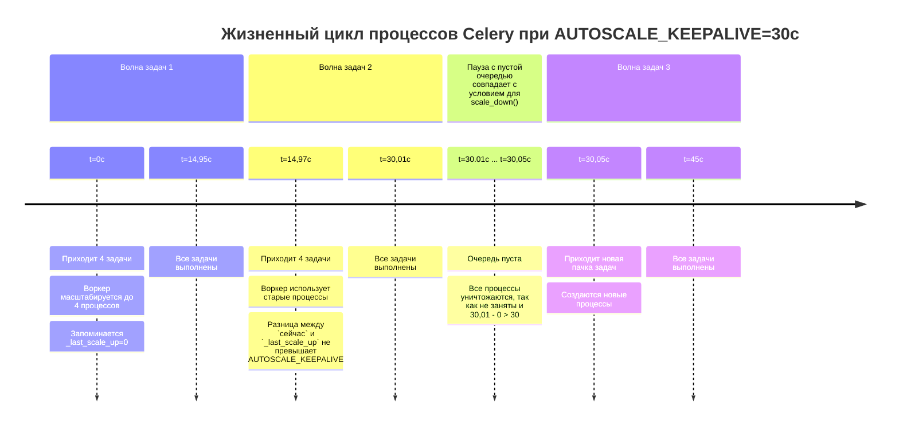

## Celery Autoscale: что в лоб — то по лбу?

Моей первой большой самостоятельной работой программиста была инвентаризация celery-задач. Нам с товарищем по бэкенду достался легаси-проект товарно-учетного приложения.
С горем пополам перевезли его из Hetzner в родное «облако» и поняли, что срочно необходимо всё документировать, очищать и структурировать.
Пока коллега упаковывал приложение в контейнеры, я занялся Celery, так как на этой библиотеке было завязано много бизнес-логики.

Пока группировал и отлаживал задачи, определял им очереди, нашел в документации загадочное *autoscale*. Кажется, что в тот момент этот параметр светился золотом.
Вот оно! То, что нужно! Сейчас там как всё наладится и заработает без сучка и задоринки. Ровно, чинно, благородно.

Мне повезло, что так и случилось, очереди стали более спокойными. Причин тому несколько:
- было достаточно ресурсов сервера;
- задачи были, в основном, I\O-bound;
- в процессе работы избавился от некоторых утечек памяти и ограничил время исполнения самых «отмороженных» задач.

Спустя время я решил отрефлексировать и пересмотреть тот опыт и был удивлен тому, 
как autoscale работает в действительности на разного рода очередях.
Если у вас есть сомнения, стоит ли читать статью, то предлагаю решить загадку:
```
1. Запускаем воркер:

    `-A celery_app worker --autoscale=4,0 --worker_prefetch_multiplier=1`

2. Запускаем скрипт:
    `for idx_task in range(1, 601):
        io_task.delay()
        if idx_task % 4 == 0:
            time.sleep(1.7)`
3. Который генерирует такие задачи:
    `@celery.task(name='io')
    def io_task() -> int:
        result = 0
        for i in range(10**7):
            result += i**2
        time.sleep(1)
        return result`

Вопрос: сколько всего процессов будет создано за время обработки 600 задач?
```
Варианты ответа:
1. 31
2. 4
3. 150
4. 0

Если выбрали второй вариант — 4 процесса, то мне есть, чем вас удивить.
Правильный ответ будет позже.

### О понятиях
**Воркер** — экземпляр Celery, включающий в себя процесс-супервизор и все дочерние процессы.

**Супервизор** — ведущий процесс воркера, устанавливающий соединение с брокером и порождающий и управляющий
прочими рабочими процессами. Сам задачи не обрабатывает.

**Рабочий процесс** — дочерний процесс супервизора внутри воркера для обработки задач. Создан или при старте воркера(concurrency), или динамически(autoscale).

**Очередь по расписанию** — очередь, в которой показатель Total(RabbitMQ) в любой момент времени не превышает количество рабочих процессов.

**Нагруженная очередь** — очередь, которая может иметь задачи в статусе Ready(RabbitMQ) и Total больше количества рабочих процессов.

### Prefork autoscale
Для тех, кто не знаком с Python, Celery — распределенная очередь задач, работающая через брокер сообщений.
Использует собственную библиотеку(billiard, форк от стандартной питоновской) для механизма мультипроцессинга.
Prefork — это пул по умолчанию и по совместительству самый распространенный режим, к которому применим autoscale.
Хорош для CPU-bound да и для прочих, так как не требует сторонних библиотек, в отличие от многопоточных.

Параметр autoscale задаётся при старте воркера `--autoscale=max,min` и весь жизненный цикл проходит между этих границ.
Воркеру каждую секунду необходимо проверять всем ли условиям на настоящий момент он соответствует.
Механизм autoscale[1] запускается в двух местах:
1. Это собственный цикл body() с методом maybe_scale() класса Autoscaler,
    который крутится и смотрит:
    - есть ли что в очереди?
    - можно ли добавить рабочих процессов?
2. Это callback при получении сообщения от брокера.

А вот демасштабирование работает по расписанию и лишь когда с последнего scale_up прошло более 30 секунд, 
значение по умолчанию для AUTOSCALE_KEEPALIVE.

В чем подвох загадки? В AUTOSCALE_KEEPALIVE и минимальном количестве процессов(их вовсе нет).
Каждые 1.7 секунд четыре задачи(по штуке на рабочий процесс) попадают в очередь.
Воркер их подхватывает, создает дочерние процессы и раздает им задачи.
Важно, что AUTOSCALE_KEEPALIVE отсчитывается от последнего scale_up().
Время на обработку задачи примерно от 1.6 до 2.2 секунды, то есть пауза в цикле(1.7) настроена так,
чтобы воркер закончил обработку, взял новую партию задач и очередь была +/- пустой.
Плюс, казалось бы, пренебрежительные миллисекунды на публикацию сообщений и IPC.

Но по итогу нам это дает следующее: каждый рабочий процесс подходит к порогу AUTOSCALE_KEEPALIVE,
выполнив примерно 15 задач(значение взято из логов) и очень может быть, что сейчас ждет новую.
Но цикл maybe_scale(), глядя на пустую очередь и простаивающий процесс, считает его лишним и «сворачивает».

Схематично это выглядит так(тайминги условны).



Но следом поступают задачи. И мы вынуждены снова создавать рабочие процессы.
И так повторяется практически каждые 30 секунд.

В логе выглядит так
```
[2026-04-21 09:52:14,481: INFO/MainProcess] Task cpu_intensive[f30f03c9-5c03-4f9a-a28b-6c5624549b7c] received
[2026-04-21 09:52:14,482: INFO/MainProcess] Scaling up 1 processes.
[2026-04-21 09:52:14,524: INFO/MainProcess] Task memory_intensive[c88643c5-d9b2-4014-a79e-bb1564b481c7] received
[2026-04-21 09:52:14,525: INFO/MainProcess] Scaling up 1 processes.
[2026-04-21 09:52:14,571: INFO/MainProcess] Task cpu_intensive[47e0d170-ad7c-44fb-a401-40f3a1be46bb] received
[2026-04-21 09:52:14,571: INFO/MainProcess] Scaling up 1 processes.
[2026-04-21 09:52:14,635: INFO/MainProcess] Task cpu_intensive[abedebc8-05a6-400e-bb98-4062f3633ddf] received
[2026-04-21 09:52:14,636: INFO/MainProcess] Scaling up 1 processes.
...
[2026-04-21 09:52:57,543: INFO/MainProcess] Scaling down 1 processes.
...
[2026-04-21 09:52:57,543: INFO/MainProcess] Task cpu_intensive[2ff56d89-ca89-4edf-b557-a9465b8d4f72] received
[2026-04-21 09:52:57,543: INFO/MainProcess] Scaling up 1 processes.
```

Здесь и кроется причина, что ответ не четыре, а *31*.
Четыре процесса за полный цикл работы в описанных условиях возможны при AUTOSCALE_KEEPALIVE=600.

**Правильный ответ — 31.**

*Отмечу, что разброс может быть до 34 процессов: зависит от «железа» и момента.*
*У меня задача считалась от 1.58 до 1.92 сек*

Рассчитать максимум рабочих процессов можно так:

`(общая длительность работы / AUTOSCALE_KEEPALIVE) * кол-во динамических процессов + минимальный порог`

По условию загадки общая длительность работы равна 255 секунд((600(всего задач) / 4(размер пачки)) * 1.7 секунд сна)

Подставив в формулу значения (255/30) * 4 + 0 получим 34. Если бы половина процессов была статической, то вышло бы (255/30) * 2 + 2 = 19. 
Почему: а) два любых процесса всегда живы; б) два процесса *могут* заменяться, но не чаще чем раз в полминуты.

На графике в брокере это может выглядеть так:
- левая сторона с пиками(пример нагруженной очереди), здесь autoscale будет трудно хулиганить с порождением процессов;
- для правой же стороны(пример очереди по расписанию) ситуация становится обратной.


Казалось бы! А вона оно как.

На эту тему есть открытый вопрос в репозитории фреймворка[2]. 
Возможно, прунинг процессов будет отталкиваться не от последнего скейла, а от последнего сообщения. 
Стоит ли менять значение по умолчанию? Для микрозадач, длительностью до 2 секунд, и не нагруженной очереди, скорее да. 
Но при прочих условиях вы сделаете concurrency.

### Prefork concurrency
В сравнении с autoscale concurrency — «скучная» технология: какой лимит задан при запуске
столько рабочих процессов и будет работать всю жизнь воркера(если лимит не задан, то по умолчанию использует кол-во ядер).
У него нет специальных циклов для проверки всем ли параметрам он соответствует, его ценят таким, какой он есть. И в том же количестве.
Исключением из этого правила могут стать специальные аргументы, используемые при настройке инстанса Celery.
Или форс-мажоры типа падения воркера. Впрочем, эти же факторы распространяются и на autoscale

Я не буду подробно останавливаться на всем многообразии параметров, упомяну лишь те, что непосредственно влияют на тему статьи.
Это `--max-tasks-per-child` и `--max-memory-per-child`.
Если с первым из названия можно понять, что это ограничение на общее кол-во выполненных задач дочерним процессом.
То у второго параметра есть любопытная особенность, на мой взгляд, неочевидная:
`--max-memory-per-child` накладывает ограничения по затраченной памяти не в рантайме,
а на «жизнь» самого процесса, то есть если вы настроили 100 MB,
а задача потребила 120 MB, то после выполнения процесс будет заменён новым[3]. Причем память все равно может утекать,
так как исчерпание предела проверяется после выполнения задачи; внутри процесса же — можно доработаться и до OOM Killer.
Поэтому эта настройка может выйти боком и процессы будут пересоздаваться чаще, чем требуется.

## Runtime
Давайте же посмотрим, как с подобными загадке задачами будет справляться celery в обозначенных режимах.
Я подготовил сводные таблицы с фиксированными и динамическими рабочими процессами,
отображающую производительность, за которую мы можем побороться этими инструментами.
Увидим сколько рабочих процессов будет обслуживать один цикл и как меняются скорость обработки одной задачи
от постановки до результата и общая пропускная способность. И есть ли вообще разница.

#### Что такое производительность?
В настоящем контексте мы можем рассматривать 4 вида:
- Пропускная способность(throughput), кол-во задач в секунду;
- Обработка одной задачи(latency), сек;
- Обработка N задач (общее время), сколько времени займет разбор фиксированной пачки;
- «Шумный» сосед, отъём ресурсов и, как следствие, снижение работоспособности других процессов.

Упор будет на throughput и latency, так как а) фиксировано время скрипта(для 3 пункта не подойдет);
б) нужно отдельно контролировать какой-то важный процесс(для соседа), что увеличивает сложность эксперимента.

#### Рабочее окружение
Все замеры проведены с версией celery 5.6.3, на ноутбуке
с процессором AMD Ryzen 5 5500U with Radeon Graphics × 6
в консоли Linux Mint 22.3 - Cinnamon 64-bit.

С помощью cgroups и cpuset ограничил эксперимент двумя ядрами(первые потоки): 5 и 6. 
Некая имитация отдельного 2х-ядерного сервера.

Брокер: RabbitMQ. *Для некоторых брокеров, к примеру, старых версий Redis механизм получения задач может работать иначе.*

#### Методика
Каждые 1.6(по расписанию — 5) секунд в брокере публикуются задачи(I/O и memory-bound, нормальный runtime которых 1.7 сек)
в количестве равным максимальному кол-ву рабочих процессов.
Для autoscale нижним порогом является половина от максимума.
К примеру, если concurrency=4, то в паре будет autoscale=4,2.
Каждый рабочий процесс ограничен worker_prefetch_multiplier=1, то есть может за раз взять одну задачу.
Длительность одного замера 300 секунд с перезапуском воркера.
Каждый вариант(2 очереди Х 2 режима Х 3 кол-в процессов) по 20 раз.

Все 240 замеров были проведены в случайном порядке.

## Нагруженная очередь

| Режим          | Ср. процессов* | Длительность (с) | Задач   | Throughput (з/с) | Сред. latency (с) | CV latency | 95% ДИ для среднего | Медиана (с) | 90-й перц. (с) | 95-й перц. (с) |
|----------------|----------------|------------------|---------|------------------|-------------------|------------|---------------------|-------------|----------------|----------------|
| autoscale(2,1) | 2.90           | 303.94           | 363.8   | 1.20             | 6.33              | 74.0%      | [4.14 – 8.51]       | 5.44        | 8.13           | 8.90           |
| concurrency(2) | 2.00           | 303.93           | 366.3   | 1.21             | 5.22              | 4.5%       | [5.11 – 5.33]       | 5.22        | 7.78           | 8.15           |
| autoscale(4,2) | 7.50           | 303.99           | 716.0   | 2.36             | 8.65              | 65.5%      | [6.00 – 11.29]      | 7.57        | 12.52          | 14.56          |
| concurrency(4) | 4.00           | 303.91           | 726.0   | 2.39             | 6.63              | 14.0%      | [6.20 – 7.06]       | 6.61        | 9.91           | 10.85          |
| autoscale(8,4) | 11.40          | 302.71           | 1281.2  | 4.23             | 22.42             | 4.1%       | [22.00 – 22.85]     | 21.97       | 39.15          | 41.52          |
| concurrency(8) | 8.00           | 302.73           | 1281.2  | 4.23             | 22.55             | 9.7%       | [21.53 – 23.57]     | 22.02       | 38.71          | 41.27          |

## Очередь по расписанию

| Режим          | Ср. процессов* | Длительность (с) | Задач  | Throughput (з/с) | Сред. latency (с) | CV latency | 95% ДИ для среднего | Медиана (с) | 90-й перц. (с) | 95-й перц. (с) |
|----------------|----------------|------------------|--------|------------------|-------------------|------------|---------------------|-------------|----------------|----------------|
| autoscale(2,1) | 11.00          | 302.65           | 60.0   | 0.20             | 1.67              | 0.2%       | [1.67 – 1.67]       | 1.65        | 1.78           | 1.79           |
| concurrency(2) | 2.00           | 302.65           | 60.0   | 0.20             | 1.65              | 0.2%       | [1.65 – 1.66]       | 1.65        | 1.68           | 1.72           |
| autoscale(4,2) | 22.00          | 302.68           | 120.0  | 0.40             | 1.69              | 0.7%       | [1.69 – 1.70]       | 1.68        | 1.76           | 1.88           |
| concurrency(4) | 4.00           | 302.68           | 120.0  | 0.40             | 1.66              | 0.2%       | [1.66 – 1.66]       | 1.65        | 1.69           | 1.74           |
| autoscale(8,4) | 43.75          | 302.74           | 240.0  | 0.79             | 1.87              | 0.5%       | [1.87 – 1.88]       | 1.85        | 2.07           | 2.15           |
| concurrency(8) | 8.00           | 302.75           | 240.0  | 0.79             | 1.89              | 7.9%       | [1.82 – 1.95]       | 1.80        | 2.09           | 2.28           |

`* - среднее количество процессов созданных одним воркером за один прогон 300 секунд`
### Малые выводы о prefork autoscale
Когда я впервые взялся за эту тему, то первым тезисом, который собирался отстаивать, был «Остановите autoscale! Он убивает систему и latency».
И таблицы выше на первый взгляд это подтверждают.
1. Autoscale в нагруженной очереди может быть нестабилен. Его ДИ выходит за «приемлемые» пределы.
2. Средний latency на 30%, а медианный на 14% хуже concurrency для 4-процессного воркера.
3. Чем больше динамических процессов в очереди по расписанию, тем заметнее разница медианного latency между autoscale и concurrency в пользу второго. Хоть она и не критична.

А с другой стороны множество форков не сильно влияет на пользовательский опыт, 
что демонстрирует autoscale в очереди по расписанию или нагруженной очереди с 8 процессами. 

Стоит ли отказываться от autoscale? Если у вас есть постоянно нагруженная очередь, то concurrency скорее всего будет лучшим решением.
По крайней мере вы можете себя избавить от лишних раздумий и поисков скрытой угрозы при неконтролируемом обновлении процессов.
С другой же стороны для задач по расписанию можно настроить «призрачный» воркер. Есть задачи — есть процессы.

Надеюсь, статья станет для вас хорошим подспорьем для проведения инвентаризации собственных celery-задач.

### В качестве заключения
Изначально статья называлась Что в лоб — то по лбу и точка. Но при сборе метрик я сменил гнев и поспешные выводы
на милость и обоснованные решения. Поэтому заменил точку на вопросительный знак.

Я признаю ограничения, которые мешают делать широкие и далеко идущие выводы. Для ЦПУ-цепких задач, где процессор всегда много занят,
форки могут оказать негативное влияние. Для двух потоков на одном ядре, я получал обратные данные, и размах был велик.
А когда я не ограничивал ядра и процессы кочевали по всему железу, тогда autoscale проигрывал на 5-10% и в latency, и в пропускной способности.
Но истина всегда конкретна: был выбран конкретный пример с конкретными ограничениями и данные изменились.

Я не стал описывать принципы работы Celery с архитектурными особенностями, иначе бы вышло громоздко и отвлекло от темы.
Многообразие настроек, распределение по очередям, предвыборка и «голод» процессов — это всё влияет скорость и качество обработки.
Если будет интересно — следующей разберу архитектуру фреймворка;
также планирую охватить темы Canvas Workflows, масштабирования для gevent/eventlet и docker/K8s.
А может быть пройтись по очередям и принципам их создания, ведь порой проблемы не в том, как работает механизм, а с чем и в какой последовательности.


### Источники
1. Celery Autoscaling: Scaling Decision Flowchart — https://deepwiki.com/celery/celery/5.6-autoscaling#scaling-decision-flowchart
2. Issue #8943: Autoscale should only scale down if no tasks were accepted during keepalive period  — https://github.com/celery/celery/issues/8943
3. Billiard Worker Process Lifecycle — https://deepwiki.com/celery/billiard/2.2-worker-process-lifecycle#the-work-loop

Исходный код эксперимента: https://github.com/okolobackend/Celery-Architecture-and-Scaling
